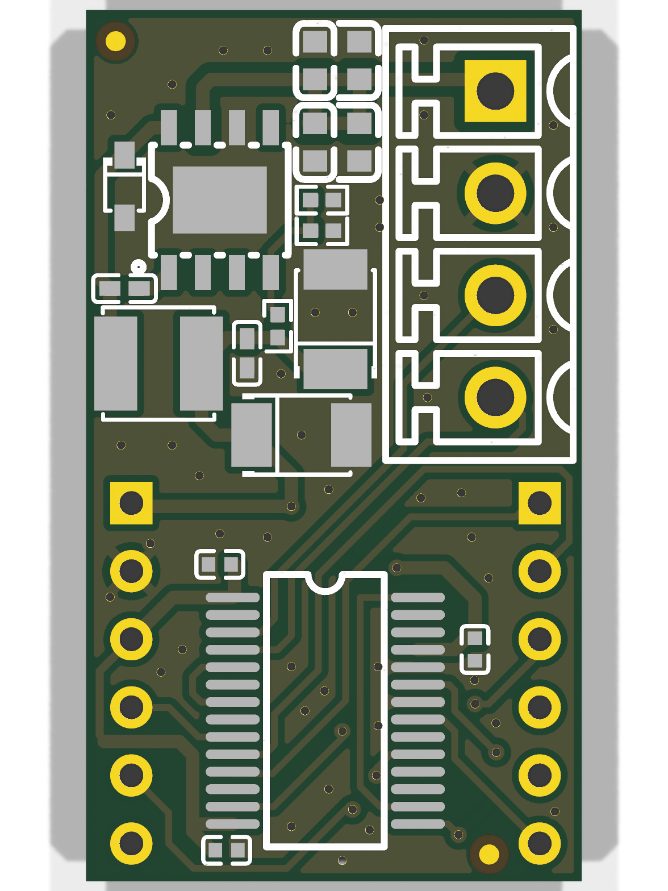

# fahrenheat-hardware

A hat for the ESP32-C3 SuperMini that adds CAN-FD and 12 V input. [Firmware](https://github.com/jagheterfredrik/fahrenheat) written on Zephyr.

- **CAN:** MCP251863 (CAN FD controller + transceiver) over SPI
- **Power:** TPS5430 buck, VCC in → 5 V to the SuperMini
- **CN1:** 3.81 mm terminal — VCC, GND, CANL, CANH

## Ordering

All parts carry LCSC numbers. `python3 export_jlcpcb.py` writes gerbers, BOM and CPL to `jlcpcb/` for JLCPCB assembly.
